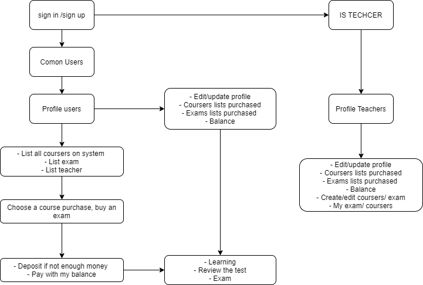

EDUTECH CORE - AKITEC
======================
## Introduce project 

Is the core project online course

## Install project
### Window
- Install xampp (php7.3)
Download on site https://www.apachefriends.org/download.html 
Note: Choose version 7.3.18 / PHP 7.3.18
Install as usual

- Start Apache, mysql

- Access localhost/phpmyadmin and create database name edut-core

- Download composer and install

- Use Composer install laravel

- Cd htdocs

- git clone https://github.com/Hunghus/edut-core.git

- Cd edut-core

- composer install

- cp .env.example .env

- change .env

- php gen key
 
### Linux
### Install Apache2, Php 7x, Laravel 5.8

### Clone site
git clone https://github.com/Hunghus/edut-core.git

cd edut-core
composer install

